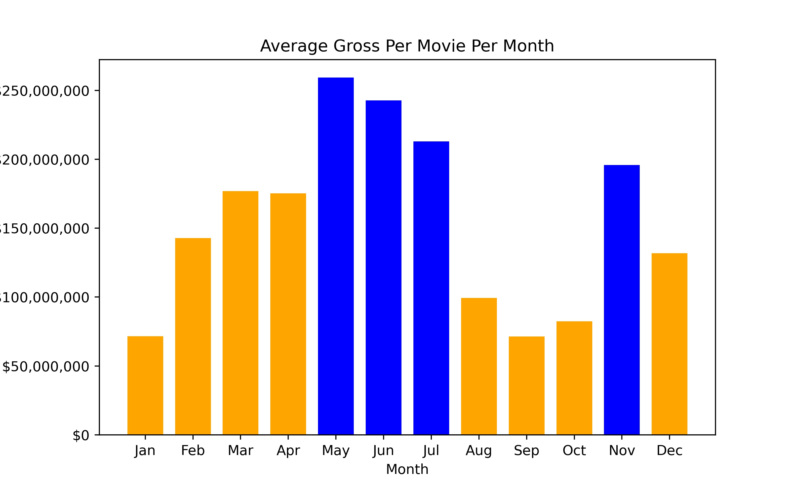
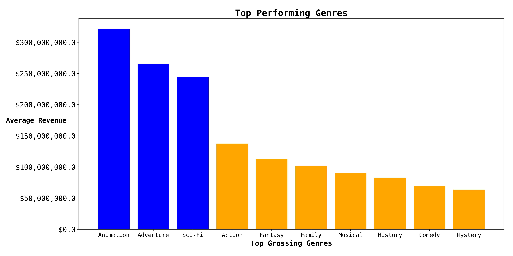

# Microsoft Needs Movie Production Analysis

#### Author: Anat Jacobson, Keanan Ginell, & Max Ross


## Overview
IMDb stands for Internet Movie Database and is a massive online website directory housing tons of information related to films, TV programs, video games, internet streams and more1. IMDb also contains data about the relevant cast, directors, producers, plot summaries, trivia, movie quotes, fan reviews and ratings1.

Production companies can use IMDb’s Film and TV ratings prediction system which uses data mining and machine learning techniques to determine the ratings of a proposed future film or TV show before they green-light a proposed project23.


## Business Understanding:


Microsoft’s is starting a new film studio and they need 3 actionable insights to ensure this new studio is a success. The stakeholders of this project include: Microsoft has a global customer base and the market competitors are US based studios. To increase the profitability of Microsoft Studio, we identified 3 key insights that can improve the odds of producing profitable movies. The analysis you will see below is based on various datasets where we define profitability of as having higher worldwide gross revenue. Our conclusions after the below analysis include identifying:

1. What is the best month to release films
2. What are the top performing genres
3. What is the best production budget size

## Data
- Movie Industry websites IMDB and TMDB have a vast amount of information regarding everything that goes in to movie production as well as financial. The data provides the different genre of the movies, the cast and crew, as well as budget and gross revenue to release the movies.

## Methods
- This project uses descriptive analysis of movie trends in successful movies starting from 2010. This provides a useful overview of what Microsoft should consider when creating their movie.

## Results

##### 1. Month of year to release movie by most worldwide-gross:

- Highest average gross is in the summer months (May - July) and November
- All ages of school are off in the summer which means more downtime and need to get out and do something (i.e. like seeing a movie)
- Presumably the reason for dip in August is due to most people going on vacation during the august month. Aditionally, in more western parts of the US school begins again as easy as august which would lead to a drop.
- November sees a high gross as well since this is when Award show season begins to close and often the movies loking to receive awards try to be released at the end of the season so that they are at the top of peoples minds
    - This also correlates with why January is such a low Worldwide Gross because the great movies do not want to   be released in the beginning of the year and then be forgotten abouts 


##### 2. Most successful genre(s) by worldwide-gross:
- In order to get a better picture of how genre effects worldwide gross I needed to isolate individual genres so that I could apply a central tendancy to the 'worldwide_gross' of each genre and plot the results to show the average best performing genres.

- The plot shows that Animation, Adventure, and Sci-FI are, on average, the highest performing genres and will typically generate the highest revenue. This does not show the whole picture for genres. To understand the actual highest performing genres we have to look at the 'actual' genres of movies that are most often a mix of different genres

- So the 'actual' top genres are or include a mix of Adventure, Animation, and Sci-Fi and basedd on the results of 'actual' genres you'll want to use a combination of atleast two of the top 3 genres.


##### 3. Optimal budget range by worldwide-gross:


- Profit and profit margin were both calculated in this however it is in accurate and misleading. Production Budget represents the budget allocated for filming. This can be exceed and while this is rare the greater issue is that production budget does not include additional expenses. These can be costs to show movie in theaters, marketing, promotion. The Numbers has estimated these expenses to be in the hundreds of millions for large budget films like Frozen. All charts and plots using profit and profit margin were removed if used in a misleading context.
- Mean production budget increases at a relativly linear rate. While mean worldwide gross revenue increases at more of a exponential rate. The relatinoship of this means that highe rbudgets ismorelikley to yield higher worldwide gross revenues. Based on this Microsoft should aim for a production budget greater then 65 million.

## Conclusions and Recommendations
This analysis leads to three reccommendations for considering the best movie production concepts that will lead to a higher rate of success for Microsoft's new movie studio.

Release movies during the months of May to July or in the Month of November. Based on our anaylsis of the average gross made from each movie per month, we reccommend Microsoft release movies either for summer viewing or at the end of the year for optimal award show winning potential.
Create movies that are of genre type 'Animated, Adventure, Comedy'.
Set a budget for your movie of $65 million. Based on our analysis, this is the budged that provied the highest Yield and and ROI (within our limited dataset).

## Next Steps
Further analyses could yield additional insights to further improve operations at Microsoft Studios.
- **More insight into the effect of rating on movie success**
- **More insight into the effect of cast and crew on movie success**

## For More Information
See the full analysis in the [Jupyter Notebook](./Microsoft_Studios_Analysis.ipynb) or review this [presentation](./Microsoft_Studios_Analysis.pdf).

For additional info, contact Anat Jacabson at [anat-jacobson](https://github.com/anat-jacobson), Keanan Ginell at [KeananG](https://github.com/KeananG), or Max Ross at [ImMaxRoss](https://github.com/ImMaxRoss)


## Repository Structure

```
├── data
├── images
├── README.md
├── Movie_Project.pdf
└── Movie_Project.ipynb
```